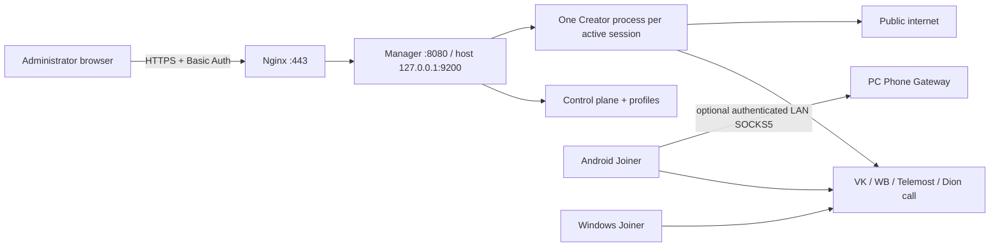
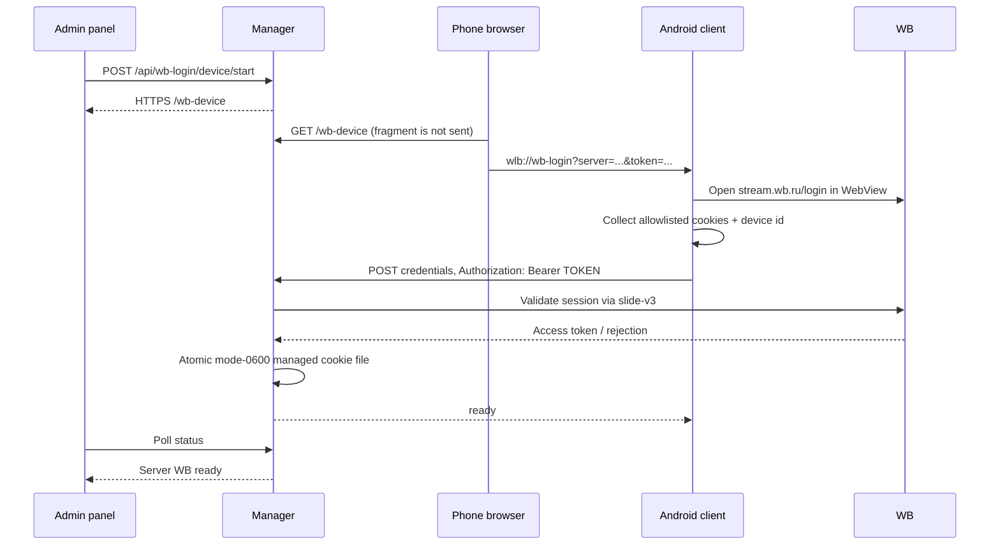

# Project handoff · 2026-07-26

Этот документ — точка входа для следующего разработчика или AI-агента. Основная
архитектура относится к `v0.5.0-alpha.19`; опубликованный `v0.5.0-alpha.20`
исправляет post-login завершение Android WB и описан в
`ALPHA20_RELEASE_NOTES.md`.

## 1. Репозиторий и происхождение

- Repository: `Sereza111/whitelist-bypass-portainer`.
- Current immutable release: `v0.5.0-alpha.19` at commit `61f5943`.
- Upstream: `kulikov0/whitelist-bypass`, branch `feature/kcp-over-vp8`, base
  commit `64aa77acd5b52c34f5ddbd1ad0d861ea65bc8943`.
- Attribution: `LICENSE` and `NOTICE` must remain intact.
- Runtime image:
  `ghcr.io/sereza111/whitelist-bypass-portainer:v0.5.0-alpha.19`.

Before transport work, read `AGENTS.md`, `PROTOCOL_ARCHITECTURE.md`,
`PERFORMANCE_ROADMAP.md` and `TARGET_ARCHITECTURE.md`.

## 2. Product topology



`portainer-stack.yml` is the normal deployment. Do not run the direct stack and
Manager stack together. Persistent state is in `/data`; never delete that volume
during an upgrade. Container UID/GID is pinned to `999:999`.

## 3. Runtime components

| Component | Source | Responsibility |
|---|---|---|
| Manager | `headless/manager` | Panel, profiles, session supervisor, provider identity, recovery |
| Creator | `headless/{vk,wbstream,telemost,dion}` | Creates one call and bridges relay traffic |
| Relay | `relay` | Handshake, mux, KCP/raw carrier, DNS, queues, SOCKS/TUN |
| Android | `android-app` | VPN/Proxy Joiner, recovery, phone gateway, WB device login |
| Windows | `joiner-desktop-app` | Wintun/SOCKS Joiner and Android Phone Gateway |
| Container | `headless/docker` | Multi-arch Manager/Creator runtime |

One active call currently supports one active Joiner. A second Joiner replaces
the current PeerConnection. Scale by separate Manager profiles/sessions.

## 4. Two different pairing operations

Do not mix these concepts:

1. **Provider identity onboarding** gives the server a technical account which
   can create calls. VK uses server-side QR Chromium. WB uses the phone-assisted
   flow described below.
2. **Guest client onboarding** gives a user/device one call link. It uses the
   15-minute `/join/<token>` → `wlb://import` flow. Guest clients do not upload
   personal provider cookies.

## 5. WB device-assisted identity

### Why it exists

The VPS returns `HTTP 498`, `server: wbaas`, `status-no-id: PG-13-XS` before the
WB login form. Retrying server Chromium or increasing its timeout does not fix
an IP-reputation gate. The primary WB login therefore runs on Android through
the phone network.

### Sequence



### API contract

| Endpoint | Authentication | Purpose |
|---|---|---|
| `POST /api/wb-login/device/start` | Basic Auth + same Origin | Creates one 10-minute pairing |
| `GET /api/wb-login/device/qr` | Basic Auth | Local PNG QR, no external QR service |
| `GET /wb-device` | Public | Secret-free phone landing page |
| `GET /wb-device.js` | Public | Converts URL fragment to app deep link |
| `POST /api/wb-login/device/credentials` | One-time Bearer | Receives allowlisted mobile WB session |
| `GET /api/wb-login` | Basic Auth | Secret-free state polling |

The server keeps only `SHA-256(TOKEN)`. The token is placed after `#` in the QR
landing URL so browsers do not send it to Nginx. The Android upload sends it in
the Authorization header, never in a request path/query.

Accepted values are limited to `wbx-refresh`, `x_wbaas_token`, `_wbauid`,
`wbx-validation-key` and a syntactically bounded device id. Manager reconstructs
trusted cookie metadata, validates `slide-v3`, applies the allowlist again and
writes `/data/managed-secrets/cookies-wbstream.json` atomically with mode `0600`.

### Android implementation

- `WBLoginActivity.kt`: validates the HTTPS server/deep link, opens WB WebView,
  polls Android `CookieManager`, reads/creates `wb_auth_api_device_id`, uploads
  in a background executor and never writes credentials to logs or preferences.
- `activity_wb_login.xml`: dedicated gothic phone login screen.
- `AndroidManifest.xml`: handles only `wlb://wb-login` for this Activity.
- `SettingsScreenFragment.kt`: optional manual paste of a one-time pairing link.

The WebView path still needs a real field test against current WB protection.
Alpha.19 field test completed a real account login and reached WB Profile, but
root-only cookie probing did not start the upload. Alpha.20 detects the profile,
primes WB Stream and probes current/exact cookie paths while showing only `N/3`.
If the client gets an HTTP error after cookies appear, inspect only safe Manager
state and response class; never request raw cookies, phone, OTP or pairing URL.

## 6. Transport state

- Version/capability handshake protects older clients.
- Video carrier uses VP8 frames; WB Video and negotiated VK paths have KCP.
- WB DataChannel is reliable SCTP and must not be wrapped in another KCP layer.
- Priority KCP lane carries CONNECT and matching reliable DNS.
- Per-flow bounded queues plus DRR protect interactive flows from bulk traffic.
- Auto KCP is the normal default; Fast remains a diagnostic override.
- Generic compression and VLESS wrapping are not implemented: ordinary payload
  is usually already encrypted TLS, so neither is an evidence-based speed fix.

Known field ceiling is provider/carrier dependent. Measure actual relay counters,
not only a Speedtest UI. Record matching versions, provider, Video/DC, fps,
batch, dual-track, VPN/SOCKS mode, throughput, loaded latency, WaitSnd, queue,
drops, ACK stalls and reconnects.

## 7. Security invariants

- Never commit/log cookies, access tokens, call links, recovery keys, pairing
  URLs, Authorization headers, phone/OTP, panel credentials, signing keys or
  field logs.
- Never place a pairing bearer in a request path/query; Nginx logs paths.
- Public landing resources contain no credential and reveal no pairing state.
- Manager status/errors remain redacted; cookie presence is reported only as a
  boolean.
- Android release signing material is outside the repository. Tagged builds
  must use the existing persistent signer so alpha.9+ installs in place.
- Public Manager access must use HTTPS. Host port 9200 remains loopback-only;
  only Nginx serves TCP/80 and TCP/443.

## 8. Verification and release

Local checks used for alpha.19:

```powershell
# headless/manager
go test ./...
go vet ./...
go build ./...

# repository / Windows UI
node --check headless/manager/web/app.js
cd joiner-desktop-app
npm run build
```

Manager tests cover HTTPS-only pairing, same-origin start, bearer rejection,
local QR generation, allowlisted import, atomic persistence and status API
redaction. Relay tests passed; local Windows antivirus only denied deletion of
an already-passed temporary `tunnel.test.exe`. Standalone relay `go vet ./...`
passed.

Both branch and immutable tag CI passed for Android, Windows and Docker.

- APK SHA-256:
  `f0f711387e9ef376380e04ad910001b931347466d177340ff64e632799ffc494`
- EXE SHA-256:
  `37dacece8f8f0708b50e49667334d90a217f390d2bf8a37a044f3bcb3d2a03e4`

Published tags are immutable. Never move `v0.5.0-alpha.19`; fix forward with a
new version.

## 9. Deployment and first field test

1. Set `WLB_IMAGE=ghcr.io/sereza111/whitelist-bypass-portainer:v0.5.0-alpha.19`.
2. Update the Portainer Stack with image pull; preserve `/data`.
3. Verify `curl -I http://127.0.0.1:9200/healthz` on the VPS and
   `curl -I https://panel.yozik.ru/healthz` externally.
4. Install the alpha.19 APK over the existing persistently signed alpha.9+ app.
5. Open **Providers → WB Stream → Create phone QR**.
6. Scan without another VPN, finish WB login and confirm **Server WB ready**.
7. Create/start a WB profile, import its guest link into a matching client and
   only then benchmark the carrier.

## 10. Next engineering priorities

1. Field-verify the Android WB WebView and server `slide-v3` acceptance.
2. Replace Basic Auth with session auth + CSRF and encrypt the provider vault.
3. Add SQLite session history and structured directional performance charts.
4. Run repeatable VK/WB Video/DC A/B tests with actual relay counters.
5. Improve provider failover only after each provider identity and guest flow is
   independently stable; never treat a provider switch as a transparent packet
   migration without a new call/session handshake.
