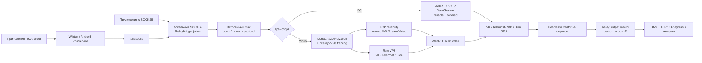

# Архитектура протокола

Зафиксировано по upstream `feature/kcp-over-vp8`, commit
`64aa77acd5b52c34f5ddbd1ad0d861ea65bc8943`.

## Путь трафика



## Уровни

### 1. TUN и SOCKS5

На Windows Joiner создаёт Wintun `10.99.0.2`, устанавливает две половины
default route (`0.0.0.0/1`, `128.0.0.0/1`) и передаёт пакеты в `tun2socks`.
`tun2socks` преобразует потоки в локальный SOCKS5 на `127.0.0.1:1080`.

SOCKS-only режим полезен для диагностики: он исключает Wintun, маршруты, MTU и
системный DNS из тестируемой цепочки.

Android может явно открыть тот же authenticated SOCKS5 listener на
`0.0.0.0:<port>` для доверенной LAN/точки доступа. Windows phone-gateway mode
не создаёт второй Joiner и не входит в звонок: локальный Wintun направляет
системный трафик в SOCKS5 телефона, а дальше используется уже активный Android
Joiner. До установки split-default routes Windows проверяет SOCKS5
username/password. Адрес телефона остаётся на исходном физическом маршруте,
чтобы соединение tun2socks с собственным upstream не зациклилось через Wintun.

### 2. Встроенный multiplexing

Проект уже мультиплексирует множество TCP/UDP-соединений внутри одного звонка.
Wire frame:

```text
uint32 frame_length | uint32 conn_id | uint8 message_type | payload
```

Типы: CONNECT, CONNECT_OK/ERR, DATA, CLOSE, UDP/UDP_REPLY и CONFIG/ACK.
VLESS-mux или yamux поверх этого слоя не устраняют ограничения нижнего
транспорта и могут добавить второй уровень head-of-line blocking.

### 3. Обфускация Video

Ключ получается из token в join link через SHA-256. Payload шифруется
XChaCha20-Poly1305 и помещается после заголовка, похожего на VP8 interframe.
Каждая посылка добавляет примерно 61 байт:

- 17 байт VP8-подобного заголовка;
- 4 байта epoch;
- 24 байта XChaCha nonce;
- 16 байт Poly1305 tag.

Ссылка является одновременно секретом подключения и материалом ключа. Любой,
кто получил ссылку, способен подключиться к сессии; её нельзя публиковать.

### 4. VP8 pacing

`VP8DataTunnel` имеет одну глобальную очередь на 128 элементов и отправляет не
больше одного элемента за tick:

```text
ticks_per_second = fps × batch
theoretical_payload ≈ fps × batch × 1126 bytes
```

При `24 × 30` получается около 810 KB/s или 6.5 Mbps до overhead, потерь,
повторов, ограничений SFU и CPU. Это потолок, а не гарантированная скорость.

Большой download способен заполнить общую очередь и задержать DNS, новые TCP
CONNECT и интерактивный трафик.

### 5. Надёжность

| Платформа/режим | Нижний транспорт | Надёжность в baseline |
|---|---|---|
| VK DC | SCTP DataChannel | reliable/ordered |
| VK Video | VP8/RTP | нет дополнительной ARQ |
| Telemost Video | VP8/RTP | нет дополнительной ARQ |
| WB Stream DC | SCTP DataChannel | reliable/ordered |
| WB Stream Video | VP8/RTP + KCP | KCP |
| Dion Video | VP8/RTP | нет дополнительной ARQ |

Для TCP потеря raw VP8 frame означает потерю байтов внутри логического TCP
потока. Внешний TCP не знает, что байты потеряны внутри proxy, поэтому страница
может зависнуть вместо нормальной TCP retransmission. Это главный кандидат на
причину частично загружающихся сайтов в VK Video.

Legacy WB KCP сохраняет быстрый профиль. Negotiated VK KCP по умолчанию
использует balanced profile: `NoDelay(1,20,2,0)`, окна `256/256`, bounded
output queue и WaitSnd backpressure. MTU adaptive-сегмента выровнен так, чтобы
обычный relay frame помещался в один carrier frame. Для сильной потери доступен
stable profile, а fast оставлен только для A/B на чистом carrier.

### 6. Server egress

Creator после demux самостоятельно открывает TCP/UDP к конечному адресу. Опция
`UPSTREAM_SOCKS` отправляет egress через другой SOCKS5 с UDP ASSOCIATE.
Это уже позволяет подключить Xray/VLESS как внешний sidecar: Xray предоставляет
локальный SOCKS5, а Creator использует его как upstream. Такая цепочка меняет
точку выхода, но не ускоряет участок Joiner ↔ SFU ↔ Creator.

## Текущие архитектурные риски

1. Raw Video не гарантирует доставку и порядок TCP payload.
2. Одна глобальная send queue создаёт head-of-line blocking между потоками.
3. В receive path есть синхронные `conn.Write`; медленный socket может задержать
   обработку всех tunnel frames.
4. Нет per-stream credit/window и ограничения памяти на активный поток.
5. Нет достаточных метрик: RTP loss/reorder, queue depth, blocked time, RTT,
   retransmits и effective Mbps не видны одновременно.
6. Windows TUN маршрутизирует только IPv4; DNS/IPv6/HTTP3 могут давать задержки
   или утечки вне туннеля.
7. Server и клиенты не имеют обязательного version/capability negotiation.

Дополнение после matching Android-теста `0.5.0-alpha.2`: двунаправленный
WebRTC carrier может деградировать только в одну сторону. При живом
server→Joiner потоке метрика общего `last input` остаётся свежей, хотя
Joiner→server ACK-прогресс прекращается и `WaitSnd` приближается к пределу.
Следовательно, health-check должен учитывать отдельный прогресс ACK/UNA для
исходящего направления, а не только наличие любых входящих KCP packets.

В `0.5.0-alpha.3` capability `priority_control` включает вторую KCP
conversation с marker `WKC2`. Через неё проходят `CONNECT` и
`CONNECT_OK/ERR`, поэтому создание нового TCP-потока больше не стоит за bulk
`MsgData` основной `WKC1` conversation. `CLOSE` пока намеренно остаётся в
основной ordered lane: без drain/sequence semantics приоритетный CLOSE мог бы
обогнать последние DATA и обрезать поток. DNS priority и полноценный fair mux
остаются следующим этапом.

Тот же релиз считает прогресс KCP ACK/UNA отдельно от любых входящих packets.
При устойчивом заполнении 75% send window без ACK-прогресса в течение 15 секунд
запрашивается штатный reconnect carrier. Creator передаёт выбранный KCP profile
после handshake, а Joiner применяет более безопасный из локального и серверного
вариантов; Android `balanced` и server `fast` теперь дают effective `balanced`.

## Реализованный compatibility handshake

В текущей ветке control plane mux расширен сообщениями:

- `MsgHello = 0x0A`;
- `MsgHelloAck = 0x0B`.

`Hello` передаёт magic `WLB2`, wire version, build version/commit,
capability bitmask, max carrier payload, текущий reliability mode, число tracks
и случайный 128-bit nonce. `HelloAck` связывается с запросом через nonce и
возвращает выбранную wire version и пересечение capabilities.

Старый v0.3.7 peer игнорирует неизвестный control frame; после трёх попыток
новая сторона фиксирует `legacyCompatibility=true` и не включает optional
features.

Для VK Video matching server/client рекламируют `video_kcp1`. Adaptive wrapper
оставляет control frames в raw, маркирует KCP segments magic `WKC1` и во время
перехода принимает оба вида payload. Обычные data frames блокируются до
результата handshake, поэтому raw и KCP не могут поменять порядок байтов одного
TCP stream. При старом peer wrapper через timeout открывает raw data path.

KCP segment MTU равен 1122 байтам: вместе с 4-byte marker он точно помещается в
1126-byte VP8 carrier payload. Relay read buffer уменьшен до 1089 байт, поэтому
`9-byte mux frame + 24-byte KCP header + marker` не создают второй segment для
обычного TCP read.

RelayBridge каждые 10 секунд пишет строку `METRICS` с relay bytes/frames,
control frames, временем блокировки `SendData`, активными TCP/UDP flows,
результатом handshake и transport-specific queue/KCP counters.
