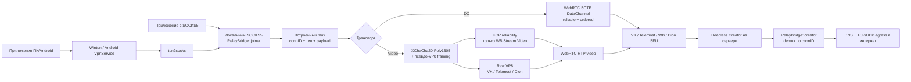

# Архитектура протокола

Зафиксировано по upstream `feature/kcp-over-vp8`, commit
`64aa77acd5b52c34f5ddbd1ad0d861ea65bc8943`.

## Путь трафика



## Уровни

### 1. TUN и SOCKS5

На Windows Joiner создаёт Wintun `10.99.0.2`, устанавливает две половины
default route (`0.0.0.0/1`, `128.0.0.0/1`) и передаёт пакеты в `tun2socks`.
`tun2socks` преобразует потоки в локальный SOCKS5 на `127.0.0.1:1080`.

SOCKS-only режим полезен для диагностики: он исключает Wintun, маршруты, MTU и
системный DNS из тестируемой цепочки.

### 2. Встроенный multiplexing

Проект уже мультиплексирует множество TCP/UDP-соединений внутри одного звонка.
Wire frame:

```text
uint32 frame_length | uint32 conn_id | uint8 message_type | payload
```

Типы: CONNECT, CONNECT_OK/ERR, DATA, CLOSE, UDP/UDP_REPLY и CONFIG/ACK.
VLESS-mux или yamux поверх этого слоя не устраняют ограничения нижнего
транспорта и могут добавить второй уровень head-of-line blocking.

### 3. Обфускация Video

Ключ получается из token в join link через SHA-256. Payload шифруется
XChaCha20-Poly1305 и помещается после заголовка, похожего на VP8 interframe.
Каждая посылка добавляет примерно 61 байт:

- 17 байт VP8-подобного заголовка;
- 4 байта epoch;
- 24 байта XChaCha nonce;
- 16 байт Poly1305 tag.

Ссылка является одновременно секретом подключения и материалом ключа. Любой,
кто получил ссылку, способен подключиться к сессии; её нельзя публиковать.

### 4. VP8 pacing

`VP8DataTunnel` имеет одну глобальную очередь на 128 элементов и отправляет не
больше одного элемента за tick:

```text
ticks_per_second = fps × batch
theoretical_payload ≈ fps × batch × 1126 bytes
```

При `24 × 30` получается около 810 KB/s или 6.5 Mbps до overhead, потерь,
повторов, ограничений SFU и CPU. Это потолок, а не гарантированная скорость.

Большой download способен заполнить общую очередь и задержать DNS, новые TCP
CONNECT и интерактивный трафик.

### 5. Надёжность

| Платформа/режим | Нижний транспорт | Надёжность в baseline |
|---|---|---|
| VK DC | SCTP DataChannel | reliable/ordered |
| VK Video | VP8/RTP | нет дополнительной ARQ |
| Telemost Video | VP8/RTP | нет дополнительной ARQ |
| WB Stream DC | SCTP DataChannel | reliable/ordered |
| WB Stream Video | VP8/RTP + KCP | KCP |
| Dion Video | VP8/RTP | нет дополнительной ARQ |

Для TCP потеря raw VP8 frame означает потерю байтов внутри логического TCP
потока. Внешний TCP не знает, что байты потеряны внутри proxy, поэтому страница
может зависнуть вместо нормальной TCP retransmission. Это главный кандидат на
причину частично загружающихся сайтов в VK Video.

Текущий KCP использует `NoDelay(1,10,2,1)`, окна `1024/1024` и MTU `1000`.
При relay payload около 1126 байт сообщение часто делится на два KCP segment,
поэтому перед переносом KCP на другие платформы нужно согласовать MTU и размер
чтения.

### 6. Server egress

Creator после demux самостоятельно открывает TCP/UDP к конечному адресу. Опция
`UPSTREAM_SOCKS` отправляет egress через другой SOCKS5 с UDP ASSOCIATE.
Это уже позволяет подключить Xray/VLESS как внешний sidecar: Xray предоставляет
локальный SOCKS5, а Creator использует его как upstream. Такая цепочка меняет
точку выхода, но не ускоряет участок Joiner ↔ SFU ↔ Creator.

## Текущие архитектурные риски

1. Raw Video не гарантирует доставку и порядок TCP payload.
2. Одна глобальная send queue создаёт head-of-line blocking между потоками.
3. В receive path есть синхронные `conn.Write`; медленный socket может задержать
   обработку всех tunnel frames.
4. Нет per-stream credit/window и ограничения памяти на активный поток.
5. Нет достаточных метрик: RTP loss/reorder, queue depth, blocked time, RTT,
   retransmits и effective Mbps не видны одновременно.
6. Windows TUN маршрутизирует только IPv4; DNS/IPv6/HTTP3 могут давать задержки
   или утечки вне туннеля.
7. Server и клиенты не имеют обязательного version/capability negotiation.
