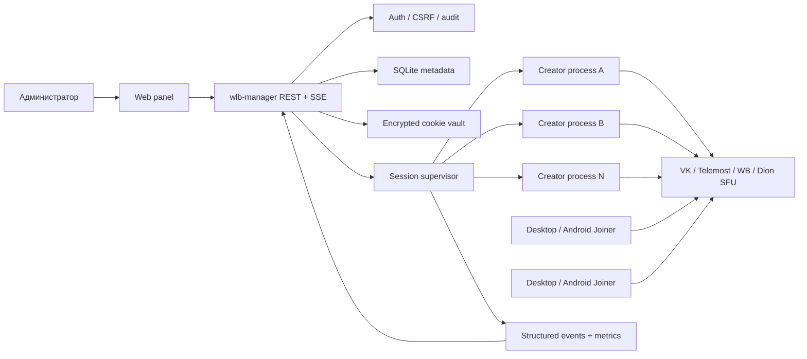
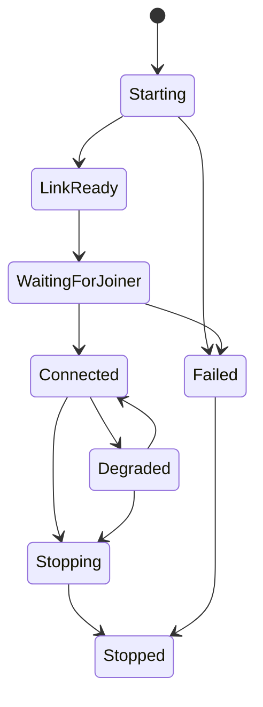
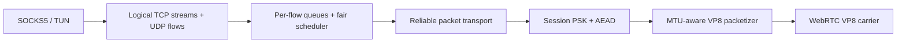

# Целевая архитектура Whitelist Bypass

Статус: proposed. Цель — отделить экспериментальный carrier через звонок от
управления сессиями, безопасности, пользовательского интерфейса и egress.

## Главный принцип

Система делится на два независимых контура:

- **Control plane** создаёт/останавливает сессии, хранит настройки, показывает
  состояние и выдаёт pairing URI.
- **Data plane** переносит TCP/UDP между Joiner и Creator. Панель не участвует в
  пользовательском трафике и не должна влиять на его скорость.



Один Creator по-прежнему обслуживает один Joiner, но manager может держать
несколько независимых процессов и ссылок одновременно.

## Компоненты

### 1. `wlb-manager` — Go control plane

Один долгоживущий процесс в контейнере:

- HTTP API и встроенная web panel;
- single-admin authentication в MVP;
- CRUD профилей Creator;
- запуск/остановка дочерних headless Creator;
- state machine каждой сессии;
- сохранение логов и метрик;
- безопасная загрузка cookies;
- graceful shutdown всех процессов;
- health/readiness endpoints.

Manager не получает Docker socket. Сессии запускаются как непривилегированные
дочерние процессы внутри контейнера — это продолжение уже существующей модели
`headless-vk-bot`, но с нормальным API и состояниями.

### 2. Session supervisor

Состояния:



Supervisor обязан:

- создавать уникальный session ID и отдельный каталог;
- передавать Creator только разрешённые параметры;
- читать structured events, а не угадывать состояние по произвольному тексту;
- ограничивать число процессов и ресурсы;
- завершать всю process group;
- скрывать cookies, PSK и полный join link из audit/log export.

### 3. Хранилище

```text
/data/wlb.db                  SQLite: profiles, sessions, audit
/data/sessions/<id>/          session events and bounded logs
/data/vault/                  encrypted provider cookies
/run/secrets/wlb-master-key   master key from Docker secret/bind mount
```

Cookies шифруются XChaCha20-Poly1305 master key, который не хранится в БД или
Git. В MVP можно продолжить read-only bind mount, а upload через panel включить
после появления vault.

### 4. Panel API

Минимальный API:

```text
POST   /api/login
POST   /api/logout
GET    /api/providers
PUT    /api/providers/:name/cookies
GET    /api/profiles
POST   /api/profiles
PATCH  /api/profiles/:id
DELETE /api/profiles/:id
GET    /api/sessions
POST   /api/sessions
GET    /api/sessions/:id
DELETE /api/sessions/:id
GET    /api/sessions/:id/events       SSE
GET    /api/metrics
GET    /healthz
GET    /readyz
```

Снаружи panel публикуется только через TLS reverse proxy. Авторизация — Argon2id
password hash, `HttpOnly + Secure + SameSite=Strict` session cookie, CSRF token
для изменяющих запросов, rate limit на login и audit log.

## Data plane v2



### Wire handshake

До передачи пользовательских данных стороны обмениваются:

```text
magic, protocol_version, session_id, capabilities,
max_carrier_payload, reliability, mux, track_count, nonce
```

Новый режим не включается, пока обе стороны не подтвердили capability. Старый
Joiner получает понятный `upgrade_required`, а не зависший туннель.

### Надёжность

Порядок реализации:

1. KCP v1 поверх VK Video как минимальный совместимый прототип.
2. MTU/read buffer alignment: один обычный relay frame — один KCP segment — один
   VP8 sample без лишней фрагментации.
3. Separate control queue и data queues.
4. Эксперимент QUIC streams/datagrams поверх VP8 carrier после получения
   baseline KCP metrics.

DC не является основной целью v2. Он может остаться legacy/diagnostic carrier.

### Mux

VLESS/yamux поверх существующего mux не добавляются. Новый mux получает:

- bounded queue на flow;
- credit-based flow control;
- deficit round-robin scheduling;
- приоритет control, DNS и interactive traffic;
- отдельную семантику TCP stream и UDP datagram;
- корректный backpressure вместо byte drop.

### Pairing URI

Panel выдаёт не голую ссылку звонка, а URI версии v2:

```text
wlb://pair/<session-id>?provider=vk&call=<encoded>&psk=<secret>&v=2
```

PSK генерируется manager и не выводится в обычные логи. Join link остаётся
carrier locator, но криптографический ключ больше не зависит только от него.

## Desktop client

На первом этапе сохраняем Electron + Go engine: это минимизирует риск и позволяет
сосредоточиться на transport. Миграция на Wails/Tauri рассматривается позже,
после стабилизации wire protocol.

UI делится на:

- **Connect:** pairing URI, большая кнопка, состояние и понятная ошибка;
- **Sessions/Profiles:** последние подключения;
- **Diagnostics:** RTT, loss, throughput, queue, carrier, egress IP;
- **Advanced:** SOCKS/TUN, DNS, pacing и experimental flags;
- **Logs:** фильтр, copy/export с автоматическим скрытием secrets.

### Gothic visual direction

- graphite/near-black background;
- muted burgundy/crimson active accents, без кислотного красного;
- тёплый ivory основной текст;
- тонкие архитектурные линии и арочные мотивы только в header/empty state;
- display serif для заголовков, системный sans-serif для управления;
- monospace для diagnostics;
- анимация только переходов состояния, с поддержкой reduced motion;
- WCAG contrast и полноценная keyboard navigation.

Стиль не должен скрывать технический статус: `Connecting`, `Carrier ready`,
`Tunnel ready`, `Degraded` и `Reconnect` отображаются раздельно.

## Предлагаемая структура репозитория

```text
cmd/
  wlb-manager/
  wlb-creator-vk/
  wlb-creator-telemost/
internal/
  controlapi/
  auth/
  sessions/
  vault/
  events/
relay/
  carrier/
  transportv2/
  muxv2/
web/
  panel/
client/
  desktop/
ui/
  tokens/
  components/
docs/
```

Переезд выполняется постепенно; существующие бинарники остаются рабочими до
готовности matching v2 Creator/Joiner.
